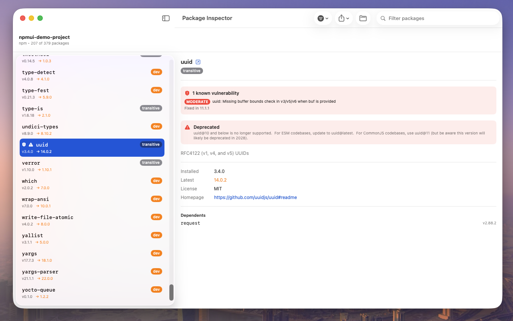
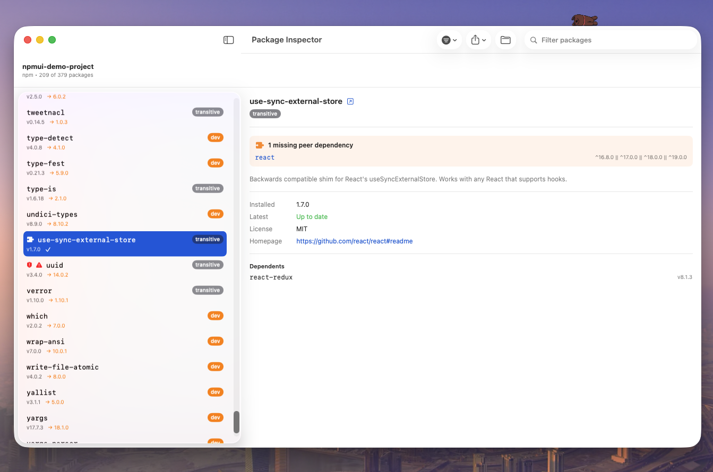
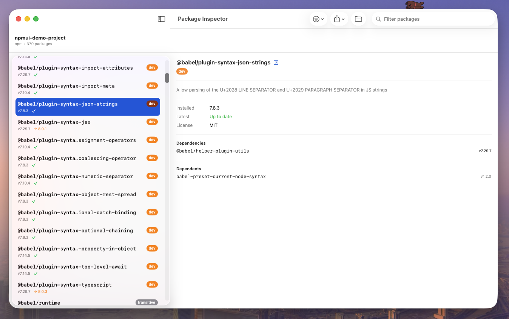
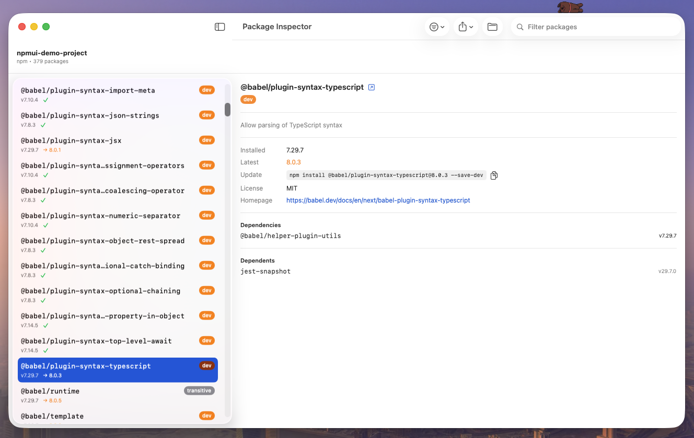

# Package Inspector

A native macOS app for seeing exactly what's installed in a Node.js project — point it at a
folder, and it reads your `package-lock.json`, `yarn.lock`, or `pnpm-lock.yaml` to show every
installed package, flag what needs attention (outdated, deprecated, vulnerable, missing peer
dependencies), and let you explore how packages depend on each other.

Built with SwiftUI. No Electron, no Node.js runtime bundled — just a small native app that talks
to the npm registry and the OSV.dev vulnerability database.

## Screenshots

**Security vulnerabilities and deprecation warnings**, with the exact fixed version called out:



**Missing peer dependencies** — flagged only when the peer isn't optional and isn't installed
anywhere in the project:



**Dependencies and Dependents** — click through the dependency graph in either direction:



**One-click update command**, in the correct syntax for your package manager and dependency type:



## Features

- **Reads your actual lock file** — `package-lock.json` (npm, v1/v2/v3), `yarn.lock`, and
  `pnpm-lock.yaml` are all supported, so what you see matches what's really installed, not just
  what's in `package.json`.
- **Dependency / devDependency / transitive** classification for every package, including
  correct handling of "diamond dependencies" (the same package resolved to two different
  versions in one project).
- **Outdated check** against the npm registry, automatic on load.
- **Security vulnerability scanning** via [OSV.dev](https://osv.dev), matched to your exact
  installed version — including the specific version that fixes each advisory.
- **Deprecated package warnings**, straight from the maintainer's own deprecation notice.
- **Missing peer dependency detection**, correctly skipping peers marked optional.
- **Dependency graph** — see what a package depends on (cross-referenced against what's actually
  installed) and what depends on it, with click-to-navigate.
- **Copyable update command** — the exact `npm install`/`yarn add`/`pnpm add` command for
  updating a package, in the right syntax for whether it's a dependency or devDependency.
- **Status filters** — narrow the list to just what needs attention (outdated, deprecated,
  vulnerable, missing peer dependencies), combinable with the search box.
- **Export** the package list as CSV or JSON for license/compliance reporting, with license data
  bulk-fetched first so the report is actually complete.
- Folder picker or drag-and-drop to load a project; direct links to each package's npm page.

## Requirements

- macOS 13 or later
- [Xcode](https://developer.apple.com/xcode/) (to build from source)
- [XcodeGen](https://github.com/yonaskolb/XcodeGen) — `brew install xcodegen`

## Building from source

```bash
brew install xcodegen   # one-time
xcodegen generate
open NPMUI.xcodeproj
```

Then build and run from Xcode (⌘R), or from the command line:

```bash
xcodebuild -scheme NPMUI -configuration Debug -destination 'platform=macOS' build
```

> The Xcode project and scheme are still named `NPMUI` internally (the app was renamed to
> Package Inspector after the project was already set up) — the app itself displays as
> "Package Inspector" everywhere it matters (Dock, window title, Finder).

The project has one small dependency, resolved automatically via Swift Package Manager:
[Yams](https://github.com/jpsim/Yams) (for parsing `pnpm-lock.yaml`).

## Usage

1. Launch the app.
2. Click **Choose Folder** and select a project folder (or drag one onto the window).
3. Browse the list — click any package to see its full detail, including its dependency graph,
   license, and any warnings.
4. Use the **Filter** menu to narrow down to packages that need attention, or the search box to
   find a specific package.
5. Use **Export** to save the full list as CSV or JSON.

## How it works

- **Parsing**: each lock file format has its own parser (`NpmLockParser`, `YarnLockParser`,
  `PnpmLockParser`) that extracts installed packages without needing `node_modules` present.
- **Classification**: packages are matched against `package.json`'s `dependencies`/
  `devDependencies` to determine dep/devDependency/transitive status, with format-specific
  signals (npm's `node_modules` path depth, pnpm's own lockfile structure, yarn's exact range
  matching) to correctly resolve diamond dependencies.
- **Registry data**: a single lightweight bulk call to the npm registry per unique package name
  covers the outdated check, the dependency graph, deprecation warnings, and peer dependency
  data — all from the same low-bandwidth response.
- **Security**: [OSV.dev](https://osv.dev)'s batch API checks every installed package against
  known vulnerabilities in one request.

## License

Personal project — add a license here if you plan to distribute this.
